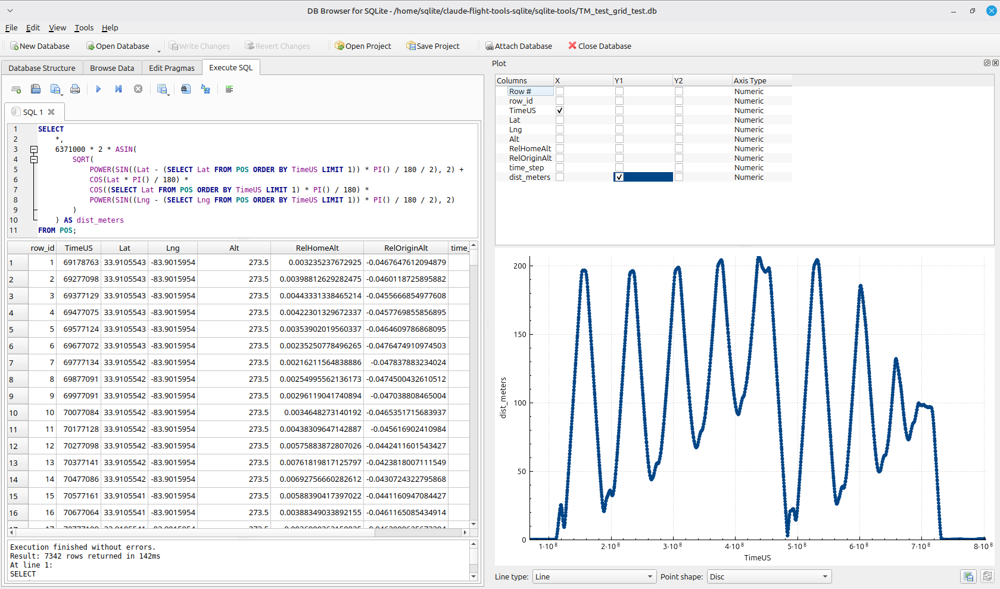

# CopterCamTech sqlite-tools

This repository contains Python scripts that create, read or report on SQLite databases that contain ArduPilot flight controller log file data.  Scripts for PX4 .ulg log files will be added in the future.

The SQLite database format makes browsing log files easy using tools such as `SQLite Studio` and `DB Browser for SQLite`.  Storing log data in SQLite also simplifies writing analysis scripts and SQL based reports.

## bin2sqlite.py

`bin2sqlite.py` reads ArduPilot .bin log files and creates a SQLite database in a single pass.  The database schema follows the structure of the ArduPilot .bin log files by creating tables for each message type, dynamically adding columns as new fields are encountered.

Here's a sample of the schema of the SQLite database the script creates.  The image shows the database using the SQL Studio (Letos) app.


This script supplements the database schema in two ways:

- It adds a `descriptions` table containing the units and description of each message type's field names, scraped from the ArduPilot documentation page https://ardupilot.org/copter/docs/logmessages.html. This allows SQL joins to include units and field descriptions directly in reports.
- It adds a `time_step` column to every table that contains a `TimeUS` field. Because different message types log at different rates, `TimeUS` values rarely line up between tables. `time_step` divides the log's full time range into a fixed number of buckets (1000 by default), so tables can be joined on `time_step` to correlate data across message types — e.g. matching GPS position to attitude at roughly the same moment in the flight.

---

## ⚙️ Features

- Converts ArduPilot `.bin` logs into SQLite `.db` files in a single read pass
- Dynamically creates tables and columns based on MAVLink message types
- Scrapes ArduPilot documentation to populate a `descriptions` table, limited to the message types actually present in the log
- Handles complex field descriptions gracefully (flagged as `COMPLEX` when a description can't be cleanly flattened to text)
- Skips the descriptions step gracefully with a warning if no internet connection is available
- Adds a `time_step` index column (with a database index) to enable time-based joins across tables
- Produces a clean, browsable SQLite database for analysis

------

## 📊 SQL Usage Example

Using apps such as DB Browser, charts can be made from the SQLite databases by using SQL to calculate desired values.  In this example, the "distance from home" is calculated using the first GPS location as the home location.



---

## 🔍 Requirements

Install dependencies using:

```
pip install -r requirements.txt
```

The required packages are:

- `requests`
- `beautifulsoup4`
- `pymavlink`

---

## ▶️ Usage

### 1. Create and activate a virtual environment

**Windows:**

```
python -m venv venv
venv\Scripts\activate
```

**Linux / macOS:**

```
python3 -m venv venv
source venv/bin/activate
```

### 2. Install dependencies

```
pip install -r requirements.txt
```

### 3. Run the converter

```
python bin2sqlite.py input.bin output.db
```

Where:

- `input.bin` is an ArduPilot log file
- `output.db` is the SQLite database to be created

### Optional flags

```
python bin2sqlite.py input.bin output.db --no-descriptions
python bin2sqlite.py input.bin output.db --no-time-index
python bin2sqlite.py input.bin output.db --time-steps 2000
```

- `--no-descriptions` — skip building the `descriptions` table (no web scraping, no internet required)
- `--no-time-index` — skip adding the `time_step` column and index
- `--time-steps N` — set the number of time buckets used for the `time_step` index (default: 1000)

---

## 📊 Output

The generated SQLite database will contain:

- One table per MAVLink message type, with a `row_id` primary key and one column per field
- A `time_step` column (and matching index) on every table that has a `TimeUS` field, enabling joins across message types by approximate time
- A `descriptions` table containing:
  - `mavpackettype`
  - `field_name`
  - `field_units`
  - `field_description`

This metadata makes browsing, understanding, and correlating log fields significantly easier.

---

## 🚀 Future Tools

This repository may grow to include additional SQLite utilities such as:

- [schema exploration tools](ca://s?q=Add_log_schema_explorer)
- [metadata browsers](ca://s?q=Add_metadata_browser)
- [table visualization helpers](ca://s?q=Add_SQLite_table_visualizer)

---

## 📄 License

This project is licensed under the **MIT License**. You are free to use, modify, and distribute this software for any purpose, including commercial applications, provided that the copyright notice and license text are included with all copies or substantial portions of the software.

For details, see the full license text in the `LICENSE` file.
