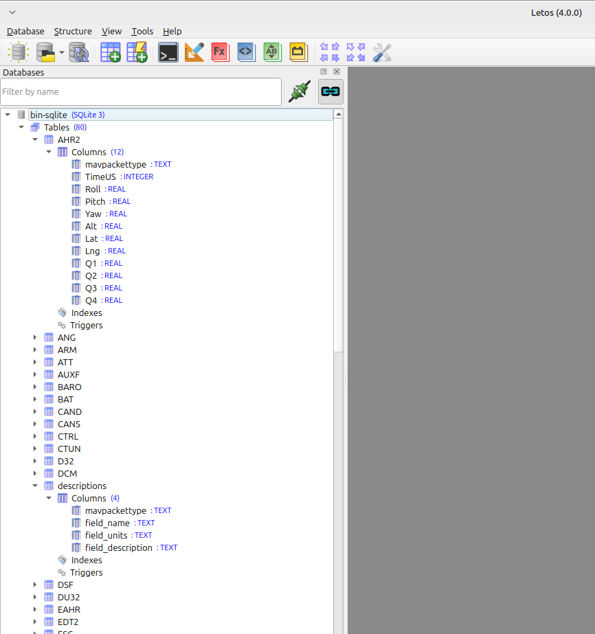

# CopterCamTech sqlite-tools

This repository contains Python scripts that create, read or report on SQLite databases that contain ArduPilot flight controller log file data.  Scripts for PX4 .ulg log files will be added in the future.

The SQLite database format makes browsing log files easy using tools such as `SQLite Studio` and `DB Browser for SQLite`.  Storing log data in SQLite also simplifies writing analysis scripts and SQL based reports.

## bin-data-desc2sqlite.py

`bin-data-desc2sqlite.py` reads ArduPilot .bin log files and creates a SQLite database.  The database schema follows the structure of the ArduPilot .bin log files by creating tables for each message type.

Here's a sample of the schema of the SQLite data base the script creates.  The image shows the database using the SQL Studio (Letos) app.

This script supplements the database schema by adding the table `descriptions` to contain the units and description of each message type field name.

This allows using SQL joins to include units and field descriptions to reports.

The descriptions are taken from the ArduPilot documentation page https://ardupilot.org/copter/docs/logmessages.html by web scraping.

---

## Features

- Converts ArduPilot `.bin` logs into SQLite `.db` files  
- Dynamically creates tables based on MAVLink message types  
- Automatically adds new columns as they appear in the log  
- Scrapes ArduPilot documentation to populate a `descriptions` table  
- Handles complex field descriptions gracefully  
- Produces a clean, browsable SQLite database for analysis

---

## Requirements

Install dependencies using: pip install -r requirements.txt

The required packages are:

- `requests`
- `beautifulsoup4`
- `pymavlink`

---

## Usage

### 1. Create and activate a virtual environment

**Windows:**

python -m venv venv venv\Scripts\activate

**Linux / macOS:**

python3 -m venv venv source venv/bin/activate

### 2. Install dependencies

pip install -r requirements.txt

### 3. Run the converter

python bin-data-desc2sqlite.py input.bin output.db

Where:

- `input.bin` is an ArduPilot log file  
- `output.db` is the SQLite database to be created  

---

## Output

The generated SQLite database will contain:

- One table per MAVLink message type  
- A `descriptions` table containing:
  - `mavpackettype`
  - `field_name`
  - `field_units`
  - `field_description`

This metadata makes browsing and understanding log fields significantly easier.

---

## Future Tools

This repository may grow to include additional SQLite utilities such as:

- [schema exploration tools](ca://s?q=Add_log_schema_explorer)
- [metadata browsers](ca://s?q=Add_metadata_browser)
- [table visualization helpers](ca://s?q=Add_SQLite_table_visualizer)

---

## License

This project is released under the MIT License. See `LICENSE` for details.
